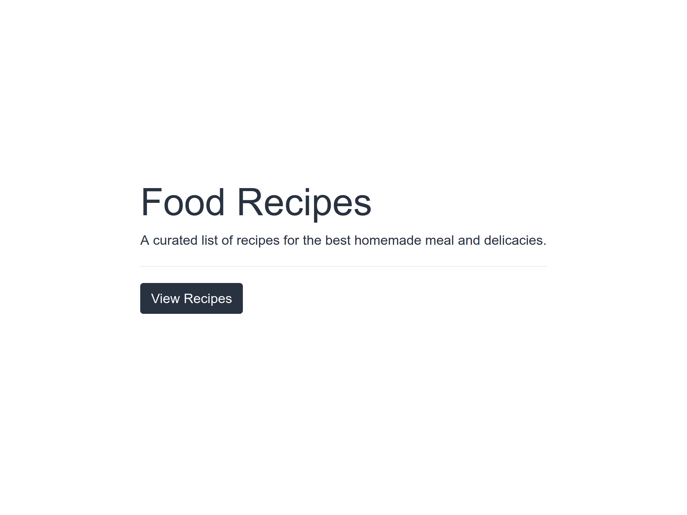

# Portfolio

> This is a Rails and React recipe app built from a tutorial by [Chuks Opia](https://www.digitalocean.com/community/tutorials/how-to-set-up-a-ruby-on-rails-project-with-a-react-frontend)



## Built With

- React
- Rails
- NPM

## Getting Started

**To get started, follow the instructions below**

To get a local copy up and running follow these steps.

- git clone this repo

```
git clone https://github.com/onedebos/recipe-app-rails-react.git
```
- cd into the folder
- run

```
bundle install
```

```
npm install
```

to install all packages. then run

```
rails s
```

- to start the app in the browser. Navigate to http://localhost:3000 in your browser to view the app.

### Prerequisites

- Node
- Ruby 2.5.1
- Rails 6

## Authors
👤 **Adebola**

- Github: [@githubhandle](https://github.com/onedebos)
- Twitter: [@twitterhandle](https://twitter.com/debosthefirst)
- Linkedin: [linkedin](https://www.linkedin.com/in/adebola-niran/)
- Portfolio: [Website](https://elegant-borg-4081b7.netlify.com/#)

## 🤝 Contributing

Contributions, issues and feature requests are welcome!

Feel free to check the [issues page](issues/).

## Show your support

Give a ⭐️ if you like this project!

## 📝 License

This project is [MIT](lic.url) licensed.
